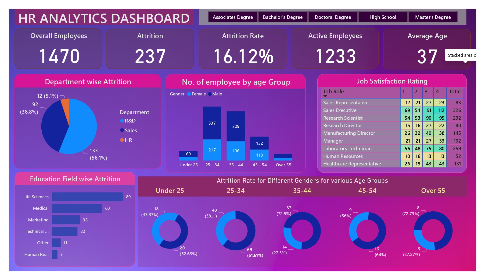
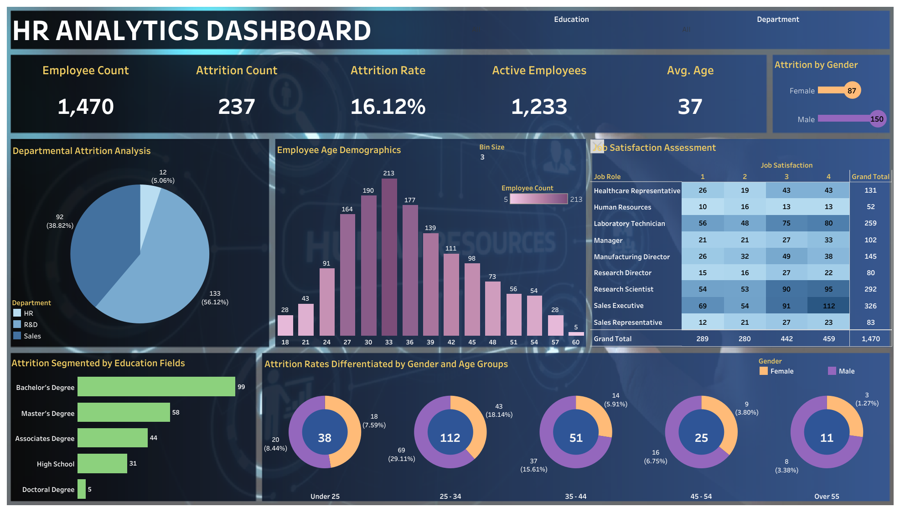

# HR Analytics Portfolio Project

Explore a comprehensive HR Analytics portfolio showcasing data analysis and visualization skills, featuring dashboards in Power BI, Excel, and Tableau, along with SQL queries for deeper insights. This project provides a holistic view of expertise in HR analytics, data visualization, and database management, offering valuable insights into workforce assessment, attrition analysis, and employee demographics.

---

## Preview of Projects

| Project | Preview | Description |
| --- | --- | --- |
| Power BI HR Analytics Dashboard |  | This dynamic and interactive dashboard emphasizes data integration and features visually appealing visualizations. [View Dashboard (PDF)](assets/powerbi_overview.pdf) |
| Tableau HR Analytics Dashboard |  | This Tableau dashboard showcases custom charts and provides insightful trend analyses. |
| Excel HR Analytics Dashboard |  | An interactive Excel dashboard with pivot tables and visually compelling charts. |

---

## Project Overview

This project addresses critical HR challenges using Power BI, Tableau, SQL, and Excel, focusing on HR Data 2022 of a medical components manufacturing company.

### Problem Statement

The HR department faces challenges in monitoring and analyzing key HR metrics. The project aims to provide insights and hands-on experience to address these challenges.

### Analysis

Key Performance Indicators (KPIs) have been designed to address various aspects, including:

- **Employee Count:** Provides visibility into the total number of employees for effective workforce assessment.
- **Attrition Count:** Tracks employee attrition to obtain comprehensive data on departed employees.
- **Attrition Rate:** Measures turnover levels for insights into employee satisfaction and engagement.
- **Active Employees:** Differentiates between active and inactive employees for accurate workforce assessment.
- **Average Age:** Examines workforce demographics for succession planning and talent retention.

Visualizations cover attrition patterns by gender, department-wise attrition rates, employee age distribution, job satisfaction ratings, education field-wise attrition, and attrition rates by gender for different age groups.

### Conclusion

This portfolio project demonstrates the effective utilization of data to derive actionable insights, showcasing technical prowess and dedication to providing valuable solutions through data analysis.
